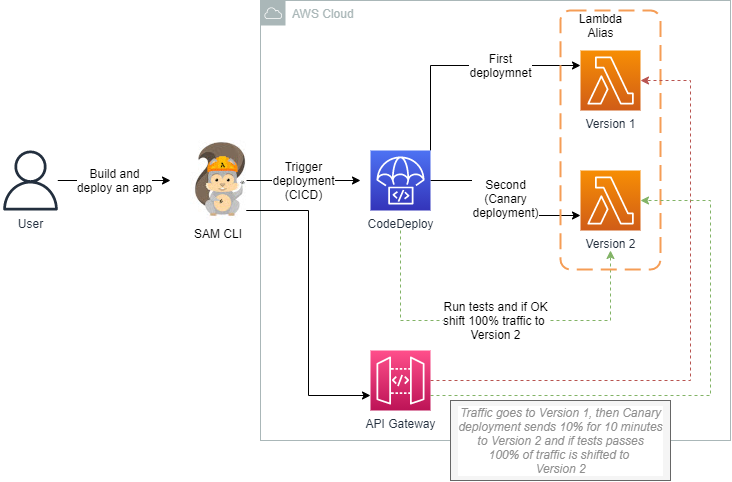
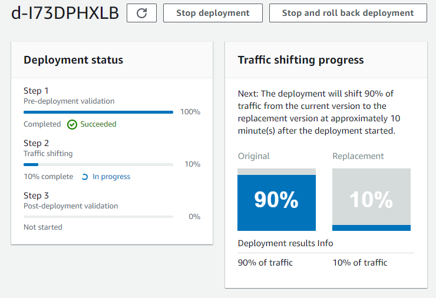
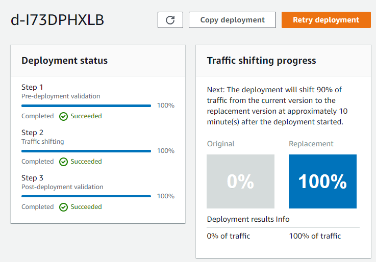
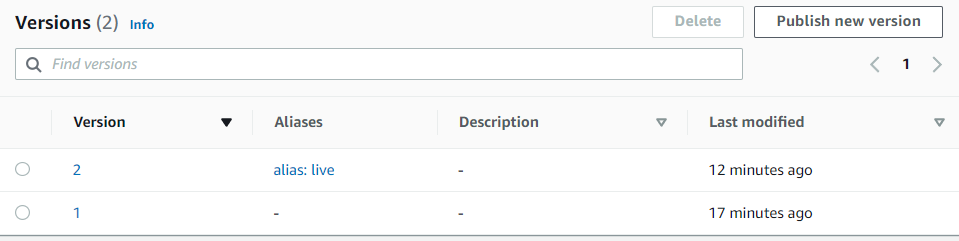

# aws-sam-with-codedeploy
  

1. Create a new application in the working folder by running this SAM command in console:

   ```bash
   sam init --runtime python3.9
   ```

   Then choose AWS Quick Start Templates ans package type *zip*. And then *Hello world Example* this will clone the app to local folder.

2. Go to *hello-sam-app* folder and run:

   ```bash
   sam build
   ```

3. Go to [template.yaml](hello-sam-app/template.yaml) and after Events add those lines of code:

   ```yaml
    AutoPublishAlias: live
         DeploymentPreference:
           Type: Canary10Percent10Minutes
   ```

   This will use CodeDeploy to switch from aliases of Lambda function in Canary type of deployment.

4. Re-run sam build after the code update.

   ```bash
   sam build
   ```

5. Time to deploy the build.

   ```
   sam deploy --guided
   ```

   This will create a changeset in CloudFormation and ask if you want to deploy all of the resources:

   So now Lambda function, API, CodeDeploy, IAM has been deployed. This environment is up and running.

6. Time to make some changes to the Lambda function code. Then again run the sam commands and deploy the updated package. When checking if the CodeDeploy Canary deployment is in progress it show that indeed it is, which will take 10 minutes as stated in sam template:



After ten minutes of this canary traffic shifting it should go into Step and shift 100% of traffic to new Lambda alias.



7. The Lambda function has been shifted to the new version

   

8. Time for clean-up, run the delet command, that will delete the S3 bucket and the CloudFormation stack

   ```bash
   sam delete
   ```